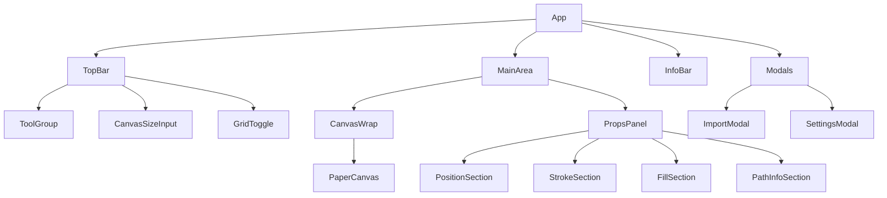

# Boring Vectors — React Rebuild Spec

_Last updated 2026-09-19._

Boring Vectors is an SVG editor _and_ maker — import and edit existing paths, or draw new ones from scratch. This spec breaks down the existing Paper.js-based prototype (the editor half) into a full feature inventory and an architecture plan for rebuilding it as a TypeScript React application; maker tools (pen tool, shape primitives) are scoped in the Build Plan below.

## Current Implementation

The artifact is a single self-contained HTML file — Paper.js 0.12.18 loaded from a CDN, no build step, no framework, no persistence.

- **Rendering**: Paper.js owns the canvas; a `background` layer draws the artboard, grid and rulers, a `content` layer holds the actual paths plus an `overlayGroup` for node/handle UI drawn on top.
- **State**: no separate app data model — the Paper.js scene graph (`Path` objects and their `segments`) _is_ the state; a plain `state` object tracks the active tool, selection, drag info and settings.
- **Tools**: Select (move/select a whole path), Node (drag anchor points and bezier handles), Add Point (click a path edge to split a curve and insert a node).
- **Import**: paste raw SVG text, expanded to `Path`s via `project.importSVG`; 5 built-in samples (star, wave, blob, arrow, heart).
- **Export**: `project.exportSVG` after hiding the background/overlay, copied to the clipboard.
- **Navigation**: manual wheel handling for zoom (⌘/Ctrl+scroll, or scroll-only via a setting) and space+drag panning; the background/overlay are fully redrawn on every zoom or pan step.
- **Panels**: top toolbar (tools, import/export, delete, canvas size, grid toggle, settings), right properties panel (position, node coordinates, stroke, fill, path info), bottom status/shortcut bar, two modals (Import, Settings).

## Feature Inventory

| Area             | Feature               | Current behavior                                                                                              |
| ---------------- | --------------------- | ------------------------------------------------------------------------------------------------------------- |
| Tools            | Select (V)            | Click a path to select and highlight it; drag to move the whole path                                          |
| Tools            | Node (N)              | Click a path to reveal its anchors/handles as an overlay; drag an anchor or a bezier handle                   |
| Tools            | Add Point (+)         | Hover a path edge (within 12px, zoom-adjusted) to preview an insertion point, click to split the curve        |
| Editing          | Delete (Del)          | Deletes the selected node (path kept ≥2 nodes) in Node mode, or the whole selected path in Select mode        |
| Editing          | Handle symmetry       | Dragging one bezier handle mirrors the opposite handle unless Alt is held                                     |
| Canvas           | Pan                   | Space+drag, or plain scroll/trackpad swipe when not zooming                                                   |
| Canvas           | Zoom                  | ⌘/Ctrl+scroll by default (0.1×–10×), or scroll-only via a Settings toggle; zooms toward the cursor            |
| Canvas           | Fit to view (0)       | Scales/centers the view so the whole artboard is visible with padding                                         |
| Canvas           | Grid (G)              | Toggles an adaptive dot/line grid with major lines every 5 units and pixel rulers on two edges                |
| Canvas           | Resizable artboard    | Width/height inputs (100–4000px), redraws background and label on change                                      |
| Import           | Paste SVG             | Textarea for raw SVG markup, parsed via `project.importSVG`, centered on the artboard                         |
| Import           | Sample shapes         | 5 presets (star, wave, blob, arrow, heart) fill the textarea for one-click testing                            |
| Export           | Copy SVG              | Strips overlay/background, serializes visible paths, copies to clipboard (falls back to opening in a new tab) |
| Properties panel | Position/size         | Read-only W/H, editable X/Y that repositions the whole path                                                   |
| Properties panel | Node coordinates      | Editable X/Y for the selected node only, shown when a node is selected                                        |
| Properties panel | Stroke                | Color swatch + picker + hex input, stroke weight (0.5–50px)                                                   |
| Properties panel | Fill                  | Color swatch + picker + hex input, explicit "no fill" toggle                                                  |
| Properties panel | Path info             | Live node count, closed/open state                                                                            |
| Settings         | Scroll-to-zoom toggle | Switches whether plain scroll zooms or pans                                                                   |

Everything above is scoped to one path at a time — there's no multi-select, undo/redo (⌘/Ctrl+Z is caught but does nothing), layers panel, or saved/named documents in the current build.

## Proposed Architecture

| Layer             | Choice                                                                                                                                                                                                         | Why                                                                                                                                                                      |
| ----------------- | -------------------------------------------------------------------------------------------------------------------------------------------------------------------------------------------------------------- | ------------------------------------------------------------------------------------------------------------------------------------------------------------------------ |
| Framework         | React 18 + TypeScript + Vite                                                                                                                                                                                   | Fast dev server, no framework lock-in beyond React itself                                                                                                                |
| Vector engine     | Keep Paper.js as the scene-graph/geometry engine, wrapped so React never touches its canvas directly                                                                                                           | Its Path/Segment/curve-splitting math is already proven in the prototype; rewriting bezier math in raw SVG is unnecessary risk                                           |
| Rendering bridge  | One `<canvas>` owned by a thin `PaperCanvas` component; React never re-renders per frame — Paper.js drives its own render loop, React drives the chrome (toolbar, panels, modals)                              | Matches the current split (canvas app vs. DOM UI) and avoids React reconciliation fighting Paper.js's own scene graph                                                    |
| App state         | Zustand (or Redux Toolkit) store for tool, selection, canvas size, grid/zoom/settings; Paper.js's own `Project` stays the source of truth for path geometry, read into the store only on selection/edit events | The current code already treats these as two different kinds of state (transient scene vs. UI); keeping that split avoids duplicating the whole path tree in React state |
| Styling           | CSS variables + CSS Modules (or Tailwind), porting the existing dark theme tokens 1:1                                                                                                                          | The current design already uses `:root` custom properties — a near-direct port                                                                                           |
| Persistence (new) | localStorage autosave + explicit "save/load .svg project" — out of scope in the prototype today                                                                                                                | Needed once this becomes a real tool people return to                                                                                                                    |
| Testing           | Vitest for state/reducers, Playwright for canvas interaction smoke tests                                                                                                                                       | Canvas apps are hard to unit-test past the state layer; interaction tests catch regressions in drag/zoom math                                                            |

Alternative considered: drop Paper.js and hand-roll SVG-DOM editing (real `<path>` elements, direct `d` attribute manipulation). This removes a dependency and lets DOM tools inspect real SVG nodes, but forfeits the tested bezier/hit-testing/curve-splitting logic Paper.js already provides — worth prototyping later, not a v1 requirement.

## Component & State Design



Each box above is one React component; `PaperCanvas` is the only one that touches the Paper.js `Project` directly — everything else reads/writes the shared store.

Core store shape (Zustand):

```typescript
interface EditorState {
  tool: "select" | "node" | "addPoint";
  selectedPathId: string | null;
  selectedSegmentIndex: number | null;
  canvas: { width: number; height: number; gridVisible: boolean; zoom: number };
  settings: { scrollZoomOnly: boolean };
  status: string; // bottom status bar text
}
```

Per-path visual properties (stroke color/weight, fill, closed) stay on the Paper.js `Path` itself, read into a derived `SelectedPathProps` view model whenever `selectedPathId` changes — mirroring how the prototype's `updatePropsPanel()` pulls straight from the Paper.js object rather than a parallel React state tree.

## Keyboard Shortcuts & Interactions

| Input             | Action                                                                  |
| ----------------- | ----------------------------------------------------------------------- |
| V                 | Select tool                                                             |
| N                 | Node tool                                                               |
| + / =             | Add Point tool                                                          |
| Del / Backspace   | Delete selected node (Node mode) or selected path (Select mode)         |
| G                 | Toggle grid                                                             |
| 0                 | Fit artboard to view                                                    |
| ⌘/Ctrl + Scroll   | Zoom toward cursor (or plain scroll, if scroll-only zoom is on)         |
| Space + Drag      | Pan                                                                     |
| Alt + drag handle | Break bezier handle symmetry (default drag mirrors the opposite handle) |
| ⌘/Ctrl + Z        | Currently intercepted but a no-op — undo/redo is not implemented        |

All shortcuts are ignored while focus is inside a text input or textarea, matching the prototype's existing guard.

## Build Plan

1. **Scaffold** — Vite + React + TypeScript project, port the CSS token system and static layout (TopBar, CanvasWrap, PropsPanel, InfoBar) with no logic yet. Building from scratch via Claude Code, guided by CLAUDE.md and this spec — not from the sample scaffold generated earlier in chat.
2. **Canvas bridge** — `PaperCanvas` component that mounts Paper.js on a `<canvas>` ref, replicates `drawBackground`/`drawGrid`/`fitCanvasInView` 1:1.
3. **Tools parity** — port Select, Node, Add Point exactly as specified in the Feature Inventory, wired to the Zustand store instead of the global `state` object.
4. **Properties panel** — wire position/node/stroke/fill inputs to the derived selected-path view model.
5. **Import/export** — port the paste-SVG modal and clipboard export; add real save/load (project persistence) as v1 scope, per the decision above.
6. **Parity pass** — walk the Feature Inventory table above as a checklist against the new build.
7. **New-project scope** (beyond parity) — undo/redo, multi-select, named/saved documents, localStorage autosave, an on-canvas ruler/measurement tool, numeric input fields for bezier handle positions (anchor X/Y inputs already exist in the Properties panel), and maker tools — a pen tool to draw new paths from scratch plus basic shape primitives (rectangle, ellipse) — so the app isn't import-only.

**Direction reference**: [svgstudio.org](https://www.svgstudio.org/) — a browser-based SVG _animation_ editor with layers, a keyframe timeline, grouping (⌘G), 100-step undo, direct-manipulation handles and clean self-contained-SVG export. It's the product-polish bar to aim for long-term, not near-term scope: v1 here stays path/node editing only — no layers, groups, timeline or animation. Revisit once the parity pass (steps 1–6) is done.

Open questions:

- Keep Paper.js as the engine — decided, per comment thread: it already works well, so the SVG-DOM alternative is deferred.
- Is persistence (save/load projects) in scope for v1, or is parity with the current prototype the only v1 goal? — Decided, per comment thread: yes, add save/load for v1; a drawing that disappears on tab close isn't useful. localStorage autosave satisfies this for v1; a portable project-file export/import is a nice-to-have on top, not required.
